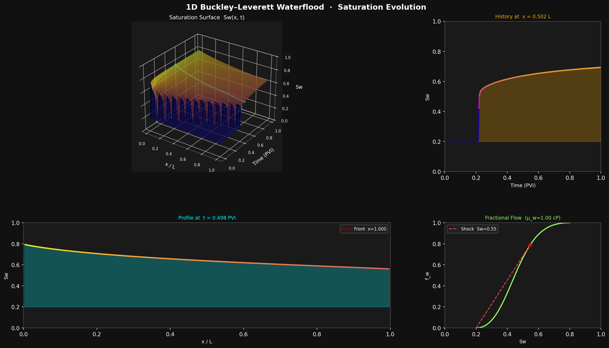
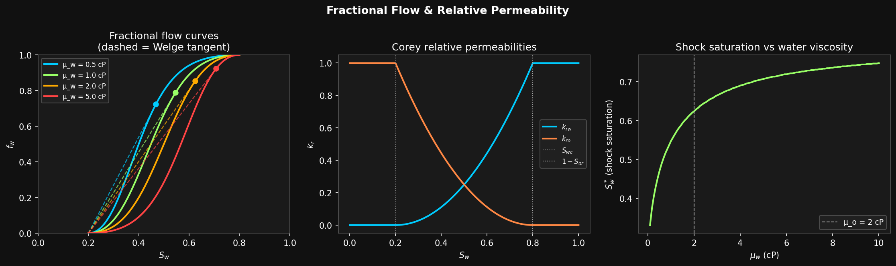
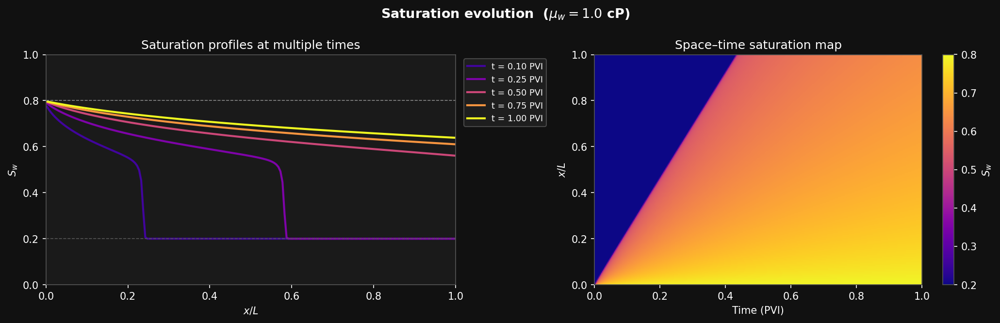
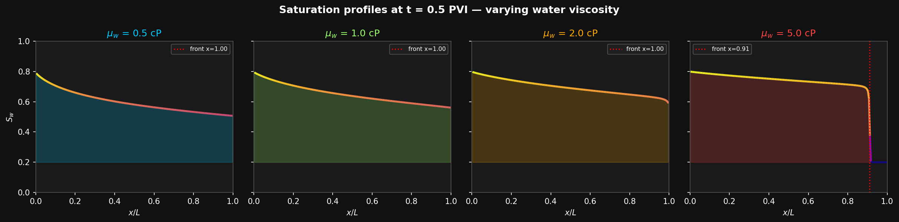

# Buckley–Leverett Waterflood Simulator

[](https://python.org)
[](LICENSE)

An interactive 1-D two-phase flow simulator built with Python and Matplotlib.  
Drag three sliders to explore how the water saturation front evolves through a reservoir under different viscosity ratios, times, and spatial locations.



---

## Features

- **Explicit upwind finite-difference** solver satisfying the CFL condition
- **3-D saturation surface** `S_w(x, t)` with interactive time- and space-slice planes
- **Fractional-flow panel** with automatic Welge tangent construction
- **Real-time re-simulation** when the water viscosity slider is moved
- **Jupyter notebook** with explanatory markdown, static publication-quality plots, and an `ipywidgets` interactive version

---

## Physics

### The Buckley–Leverett Equation

The 1-D transport of water in a porous medium under incompressible, immiscible two-phase flow is governed by:

$$\frac{\partial S_w}{\partial t} + u \frac{\partial f_w}{\partial x} = 0$$

where $S_w(x,t)$ is the water saturation, $u$ is the total Darcy velocity, and $f_w$ is the fractional flow of water.

### Fractional Flow

$$f_w = \frac{\lambda_w}{\lambda_w + \lambda_o} = \frac{k_{rw}/\mu_w}{k_{rw}/\mu_w + k_{ro}/\mu_o}$$

### Corey Relative Permeabilities

$$k_{rw}(S_w) = \left(\frac{S_w - S_{wc}}{1 - S_{wc} - S_{or}}\right)^{N_w}, \qquad k_{ro}(S_w) = \left(1 - \frac{S_w - S_{wc}}{1 - S_{wc} - S_{or}}\right)^{N_o}$$

### Shock Front — Welge Construction

Because $f_w$ is S-shaped, a shock (discontinuity) forms at the leading edge of the flood. The shock saturation $S_w^*$ and speed are found by the **Welge tangent**: draw the tangent from $(S_{wc}, 0)$ to the $f_w$ curve. The tangent point gives $S_w^*$ and the slope gives $v_{\text{shock}}$.

---

## Default Parameters

| Parameter | Symbol | Value | Description |
|-----------|--------|-------|-------------|
| Connate water saturation | $S_{wc}$ | 0.20 | Irreducible water saturation |
| Residual oil saturation | $S_{or}$ | 0.20 | Irreducible oil saturation |
| Oil viscosity | $\mu_o$ | 2.0 cP | Fixed reference |
| Water viscosity (slider) | $\mu_w$ | 0.2 – 10 cP | Adjustable |
| Corey exponent (water) | $N_w$ | 2.0 | Controls $k_{rw}$ concavity |
| Corey exponent (oil) | $N_o$ | 2.0 | Controls $k_{ro}$ concavity |
| Grid cells | $N_x$ | 200 | Spatial resolution |
| Time snapshots | $N_t$ | 300 | Temporal resolution |

---

## Installation

```bash
git clone https://github.com/<your-username>/buckley-leverett.git
cd buckley-leverett
pip install -r requirements.txt
```

---

## Usage

### Interactive Matplotlib Script

```bash
python buckley_leverett.py
```

Three sliders appear at the bottom of the figure:

| Slider | Effect |
|--------|--------|
| **Time (PVI)** | Moves the cyan time-slice plane; updates the 2-D profile below |
| **Space (x/L)** | Moves the orange space-slice plane; updates the history panel |
| **μ_w (cP)** | Re-runs the full simulation with the new water viscosity |

### Jupyter Notebook

```bash
jupyter lab buckley_leverett_notebook.ipynb
# or
jupyter notebook buckley_leverett_notebook.ipynb
```

The notebook contains:
1. Mathematical background and governing equations
2. Step-by-step code with explanations
3. Publication-quality static plots (fractional flow, saturation profiles, space–time heatmap, viscosity comparison)
4. An `ipywidgets` interactive dashboard

---

## Screenshots

### Interactive Dashboard (`python buckley_leverett.py`)

The script opens a single window with four panels and three sliders at the bottom:


| Panel | What you see |
|-------|-------------|
| **3-D surface** (top-left) | Full saturation field $S_w(x,t)$; cyan plane = current time slice, orange plane = current x slice |
| **Profile** (bottom-left) | $S_w(x)$ at the selected time; red dotted line = analytical shock-front position |
| **History** (top-right) | $S_w(t)$ at the selected x position |
| **Fractional flow** (bottom-right) | $f_w(S_w)$ curve with Welge tangent and shock point |

### Notebook Outputs

**Fractional flow analysis** — curves for four viscosity values, Corey $k_r$ model, shock saturation vs $\mu_w$:



**Saturation front evolution** — time snapshots and space–time heatmap at $\mu_w = 1.0$ cP:



**Mobility ratio study** — how the flood front changes as water becomes more or less viscous:



---

## Repository Structure

```
buckley-leverett/
├── buckley_leverett.py              # interactive Matplotlib script
├── buckley_leverett_notebook.ipynb  # educational Jupyter notebook
├── screenshots/
│   ├── dashboard.png                # full interactive script preview
│   ├── fractional_flow.png          # f_w curves, k_r model, shock vs μ_w
│   ├── saturation_evolution.png     # time profiles + space-time heatmap
│   └── viscosity_comparison.png     # four viscosity values side-by-side
├── requirements.txt
└── README.md
```

---

## References

1. Buckley, S. E. & Leverett, M. C. (1942). *Mechanism of fluid displacement in sands.* Trans. AIME, 146, 107–116.
2. Welge, H. J. (1952). *A simplified method for computing oil recovery by gas or water drive.* Trans. AIME, 195, 91–98.
3. Lake, L. W. (1989). *Enhanced Oil Recovery.* Prentice Hall.

---

## License

MIT — see [LICENSE](LICENSE).
